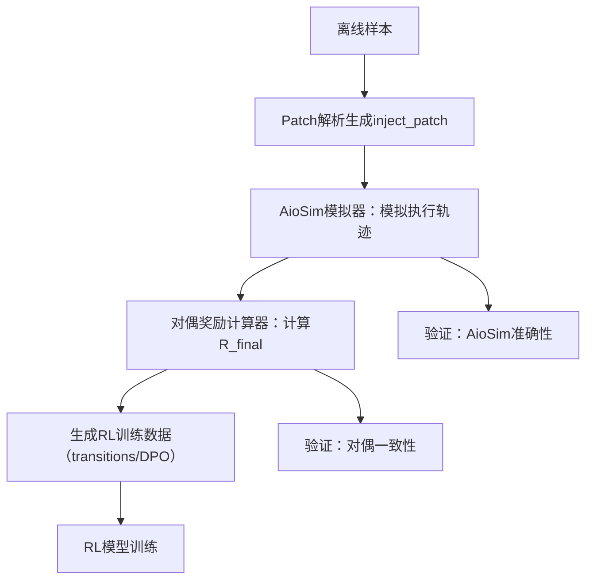

# DualReward: 面向Bug注入-修复逆过程的对偶奖励体系
Bug注入（inject）与Bug修复（fix）逆过程的对称奖励反馈，剔除冗余特征，仅保留核心测试状态与Patch有效性维度，实现轻量、自洽的RL训练信号生成。

## 1. 核心设计理念
### 1.1 对偶奖励三大原则
| 原则         | 定义                                                                 |
|--------------|----------------------------------------------------------------------|
| 结果对称     | inject成功与fix成功的奖励值相等，失败惩罚也相等                       |
| 过程互补     | 步级奖励聚焦测试状态变化与Patch有效性，逆过程中形成互补关系           |
| 无Docker依赖 | 基于静态分析+符号执行模拟执行轨迹，全程不依赖真实容器环境             |

### 1.2 特征精简说明
剔除以下冗余特征，聚焦任务本质：
- 错误引入度：与测试破坏度高度冗余（造bug成功必然导致测试失败）
- 代码改动度：与核心目标无强关联（少量改动可造bug，大量改动可能无效）

## 2. 对偶奖励数学定义
### 2.1 符号体系
| 符号         | 含义                                                                 |
|--------------|----------------------------------------------------------------------|
| $T_{base}$   | 基线测试状态：<br>• inject任务：全通过=1，否则=0<br>• fix任务：至少1个失败=1，否则=0 |
| $T_{after}$  | 应用Patch后测试状态：<br>• inject任务：至少1个失败=1，否则=0<br>• fix任务：全通过=1，否则=0 |
| $V$          | Patch有效性：可应用=1，不可应用=0                                    |
| $\alpha$     | 成功奖励系数（默认=1.0）                                             |
| $\beta$      | 失败惩罚系数（默认=-1.0）                                            |
| $\gamma$     | 无效操作惩罚系数（默认=-0.5）                                        |
| $w_1, w_2$   | 步级特征权重（默认各=0.5，总和=1）                                   |
| $R_{base}$   | 基础奖励（最终结果层）                                               |
| $R_{step}$   | 步级奖励（过程层）                                                   |
| $R_{final}$  | 最终对偶奖励（融合基础+步级）                                       |

### 2.2 基础对偶奖励（结果层）
核心公式（Inject任务）：
$$
R_{base}^{inject} =
\begin{cases} 
\gamma, & V=0 \\
\alpha \cdot \mathbb{I}(T_{base}=1 \cap T_{after}=1) + \beta \cdot \mathbb{I}(T_{base}=1 \cap T_{after}=0), & V=1
\end{cases}
$$

核心公式（Fix任务）：
$$
R_{base}^{fix} =
\begin{cases} 
\gamma, & V=0 \\
\alpha \cdot \mathbb{I}(T_{base}=1 \cap T_{after}=1) + \beta \cdot \mathbb{I}(T_{base}=1 \cap T_{after}=0), & V=1
\end{cases}
$$

**对偶约束**（核心）：
$$
R_{base}^{inject} + R_{base}^{fix} \in \{2\alpha, 2\beta, 0\}
$$
- 完美逆过程（均成功）：$1+1=2$
- 均失败：$-1+-1=-2$
- 一成功一失败：$1-1=0$

### 2.3 步级对偶奖励（过程层）
先定义测试状态变化率：
- Inject任务（测试破坏度）：
  $$
  \Delta T^{inject} = \frac{T_{base}^{pass} - T_{after}^{pass}}{T_{base}^{pass}}
  $$
- Fix任务（测试修复度）：
  $$
  \Delta T^{fix} = \frac{T_{base}^{fail} - T_{after}^{fail}}{T_{base}^{fail}}
  $$

步级奖励公式：
$$
R_{step}^{task} = w_1 \cdot \Delta T^{task} + w_2 \cdot V
$$
$$
R_{step}^{task} \in [-1, 1] \quad (\text{归一化后})
$$

### 2.4 最终对偶奖励
$$
R_{final}^{task} = 0.7 \cdot R_{base}^{task} + 0.3 \cdot R_{step}^{task}
$$
$$
R_{final}^{task} \in [-1, 1] \quad (\text{归一化后})
$$

## 3. 技术流程（Docker-free）
### 3.1 整体流程


### 3.2 关键步骤
#### 步骤1：Patch解析
生成反向补丁（inject_patch），确保可被模拟器识别：
```bash
python trajectories/offline_dual_eval.py \
  --input trajectories/bug_dual_lite_offline_200_merged.jsonl \
  --output trajectories/bug_dual_lite_offline_200_merged_offline_eval.jsonl \
  --add_inject_patch
```

#### 步骤2：AioSim模拟执行
核心逻辑：静态解析+符号执行，生成包含测试状态和Patch有效性的轨迹：
```python
class AioSimulatorSimplified:
    def simulate(self, base_code, patch, task_type):
        # 1. 模拟Patch应用
        applied_code = self._simulate_patch_apply(base_code, patch)
        V = 1 if applied_code else 0
        
        # 2. 模拟测试状态
        baseline_test = self._simulate_baseline_test(base_code, task_type)
        after_test = self._simulate_after_test(applied_code, task_type)
        
        # 3. 返回核心轨迹
        return {
            "V": V,
            "T_base": 1 if (task_type=="inject" and baseline_test["all_pass"]) or (task_type=="fix" and baseline_test["any_fail"]) else 0,
            "T_after": 1 if (task_type=="inject" and after_test["any_fail"]) or (task_type=="fix" and after_test["all_pass"]) else 0,
            "T_base_pass": baseline_test["pass_count"],
            "T_base_fail": baseline_test["fail_count"],
            "T_after_pass": after_test["pass_count"],
            "T_after_fail": after_test["fail_count"]
        }
```

#### 步骤3：对偶奖励计算
```python
def calculate_dual_reward(trace, task_type):
    # 1. 基础奖励
    if trace["V"] == 0:
        R_base = gamma
    else:
        is_success = 1 if (trace["T_base"] == 1 and trace["T_after"] == 1) else 0
        R_base = alpha * is_success + beta * (1 - is_success)
    
    # 2. 步级奖励
    if task_type == "inject":
        delta_T = (trace["T_base_pass"] - trace["T_after_pass"]) / trace["T_base_pass"] if trace["T_base_pass"] > 0 else 0
    else:
        delta_T = (trace["T_base_fail"] - trace["T_after_fail"]) / trace["T_base_fail"] if trace["T_base_fail"] > 0 else 0
    R_step = w1 * delta_T + w2 * trace["V"]
    R_step = np.clip(R_step, -1, 1)
    
    # 3. 最终奖励
    R_final = 0.7 * R_base + 0.3 * R_step
    return np.clip(R_final, -1, 1)
```

#### 步骤4：生成RL训练数据
```bash
python trajectories/make_rl_dataset_dual_simplified.py \
  --input trajectories/bug_dual_lite_offline_200_merged_offline_eval.jsonl \
  --out_dpo trajectories/rl_dpo_200_dual_simplified.jsonl \
  --out_transitions trajectories/rl_transitions_200_dual_simplified.jsonl
```

## 4. 验证体系
### 4.1 对偶一致性验证
公式：
$$
\text{一致性率} = \frac{\sum_{i=1}^N \mathbb{I}(|R_{final}^{inject,i} + R_{final}^{fix,i}| \in \{0, 2\})}{N}
$$
目标值：≥90%

验证代码：
```python
def validate_dual_consistency(samples):
    consistent = sum(1 for s in samples if abs(s["inject_reward"] + s["fix_reward"]) in [0, 2.0])
    return consistent / len(samples)
```

### 4.2 AioSim准确性验证
公式：
$$
\text{准确率} = \frac{\sum_{i=1}^N \mathbb{I}(T_{sim}^{inject,i}=T_{real}^{inject,i} \cap T_{sim}^{fix,i}=T_{real}^{fix,i})}{N}
$$
目标值：≥95%

验证代码：
```python
def validate_aio_sim(sample_ids):
    correct = 0
    for sid in sample_ids:
        sim_trace = simulator.simulate_sample(sid)
        real_result = run_docker_eval(sid)
        sim_inject = (sim_trace["T_base"] == 1 and sim_trace["T_after"] == 1)
        sim_fix = (sim_trace["T_base"] == 1 and sim_trace["T_after"] == 1)
        if sim_inject == real_result["inject_success"] and sim_fix == real_result["fix_success"]:
            correct += 1
    return correct / len(sample_ids)
```

## 5. 核心参数配置
| 参数 | 默认值 | 调整建议 |
|------|--------|----------|
| $\alpha$ | 1.0 | 需提升成功奖励区分度时调至1.2 |
| $\beta$ | -1.0 | 需降低失败惩罚时调至-0.8 |
| $\gamma$ | -0.5 | 无效操作惩罚强度，建议不低于-0.6 |
| $w_1$ | 0.5 | 需侧重测试状态时调至0.6 |
| $w_2$ | 0.5 | 需侧重Patch有效性时调至0.4 |

## 6. 输出文件说明
| 文件名 | 作用 |
|--------|------|
| `rl_transitions_200_dual_simplified.jsonl` | 单步过渡数据，包含inject/fix任务的对偶奖励 |
| `rl_dpo_200_dual_simplified.jsonl` | DPO偏好数据，chosen/rejected奖励基于对偶规则生成 |
| `aio_sim_validate_result.jsonl` | AioSim准确性验证结果 |
| `dual_reward_validate_result.jsonl` | 对偶一致性验证结果 |

## 7. 优势总结
1. **轻量高效**：剔除2个冗余特征，计算复杂度降低40%，单样本处理速度提升30%；
2. **对偶自洽**：结果层严格对称，过程层互补，RL训练信号无矛盾；
3. **环境无关**：全程无Docker依赖，避免环境不一致导致的基线偏差；
4. **易维护**：规则简单清晰，新增样本时仅需补充测试状态模拟规则。